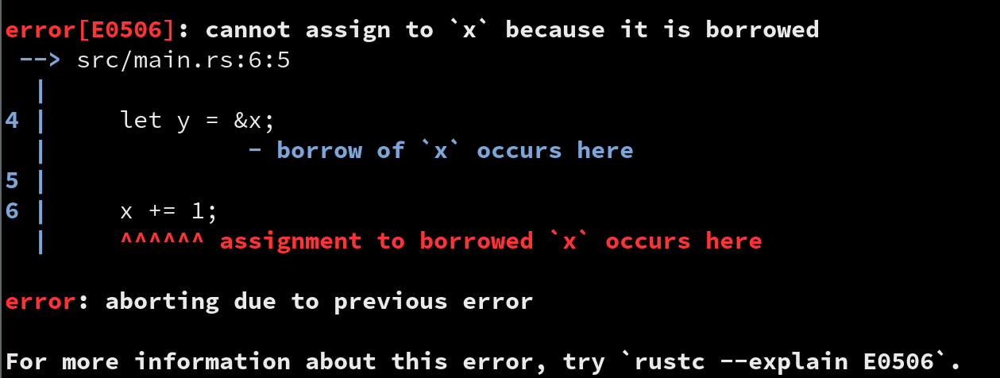

## Embedded Rust in Fifteen Minutes

James Munns

@bitshiftmask

james.munns@ferrous-systems.com

2019-03-16

::: notes

:::

---

## Before We Start...

---

## What is Rust

---

## A Systems Language

---

## Based on LLVM

---

## 2006

> Just a personal project

---

## 2009

> Official Mozilla Project

---

## 2015

> Stable 1.0 Release

---

## 2018

> Stable Embedded Systems Support

---

## Stability in Rust

> Don't Break Userspace

---

## What Does the Language Want?

---

## Focused on Safety

---

## But Also Developer Convenience

---

## But Also Performance

---

## Fast, Reliable, Productive: Pick Three

---

## It Doesn't Have to be Hard to Write

---

```rust
fn transfer(&mut self, words: &mut [u8])
    -> Result<&[u8], Error> {
    ram_slice_check(words)?; // Ensure data is in RAM
    // Perform DMA transfer
    words.chunks(EASY_DMA_SIZE).try_for_each(|chunk| {
        self.spi_dma_transfer(
            DmaSlice::from_slice(chunk),
            DmaSlice::from_slice(chunk),
            |_| {},
        )
    })?;
    Ok(words)
}
```

---

## It Doesn't Have to be Hard to Get Right

---



---

## Toolchain Setup

---

## Install Rust

> https://rustup.rs

---

## Out of the Box

> Rustup, Cargo, and Rustc

---

## Cross Compiling to Embedded?

> `rustup target add thumbv7em-none-eabihf`

---

## Cargo

> A build system and package manager

---

```
$ tree .
.
├── Cargo.toml
└── src
    └── main.rs
```

---

```toml
[package]
name = "sensor-node"
version = "0.1.0"
authors = ["James Munns <james.munns@ferrous-systems.com>"]
edition = "2018"

[dependencies]
panic-ramdump   = "0.1.0"
nb              = "0.1.1"
cortex-m-rtfm   = "0.4.1"
nrf52832-pac    = "0.6.0"
```

---

## Type Safe Low Level APIs

---

## Blinking a light

---

```rust
use dwm1001::{self, DWM1001};

fn main() {
    let mut dwm1001 = DWM1001::take().unwrap();
    let mut timer = dwm1001.TIMER0.constrain();

    loop {
        dwm1001.leds.D12.enable();
        delay(&mut timer, 20_000);  // 20ms
        dwm1001.leds.D12.disable();
        delay(&mut timer, 230_000); // 230ms
    }
}
```

---

## 2019

> A 1.0 Ecosystem

---

## Thank you!

---

## Plugs


<font size="1">icon by [Freepik] from [flaticon.com]</font>

[Freepik]: https://www.flaticon.com/authors/freepik
[flaticon.com]: https://www.flaticon.com

---

## Ferrous Systems


ferrous-systems.com

---


---

> Embedded Rust in Fifteen Minutes

James Munns

@bitshiftmask

james.munns@ferrous-systems.com

https://github.com/ferrous-systems/rust-in-fifteen-mins


---
